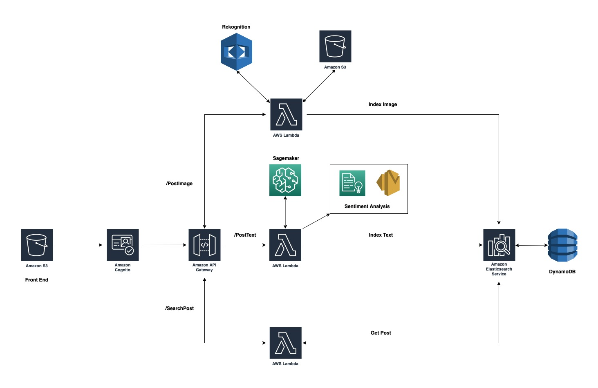
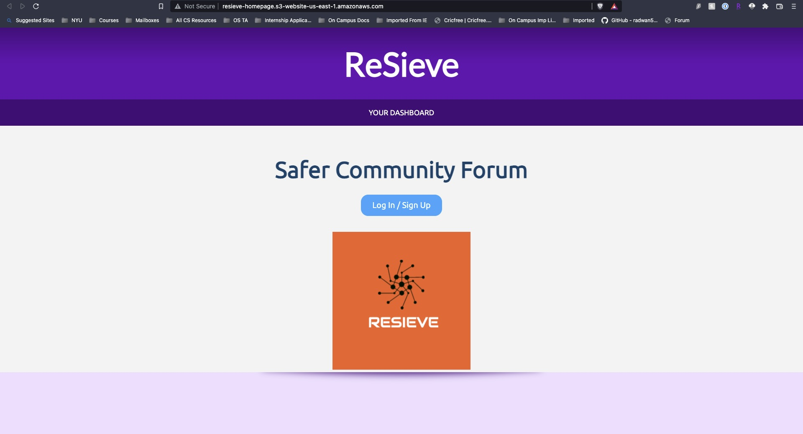
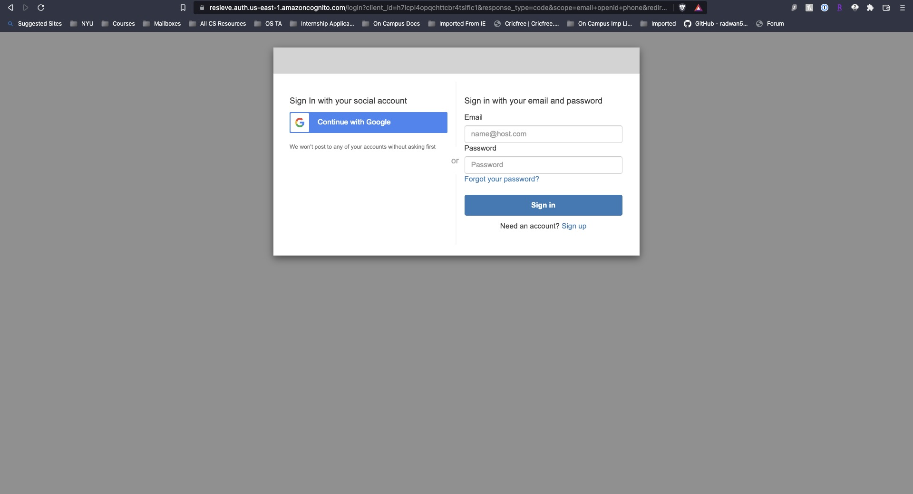
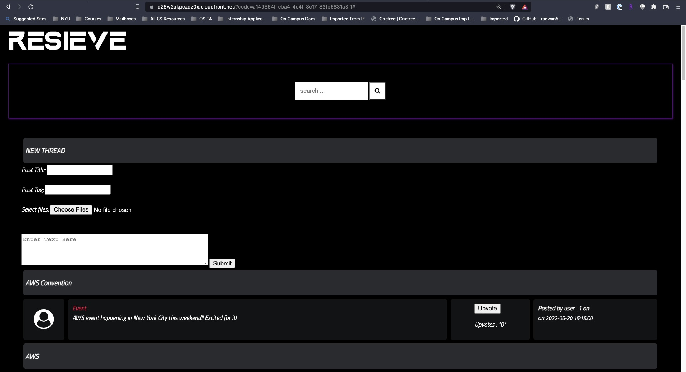
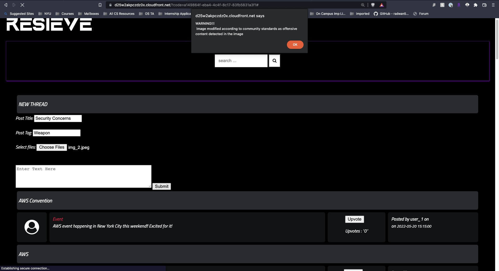
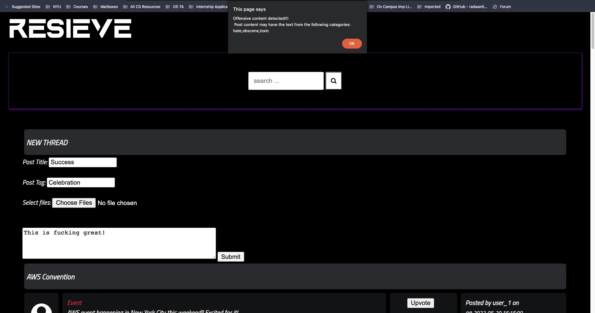
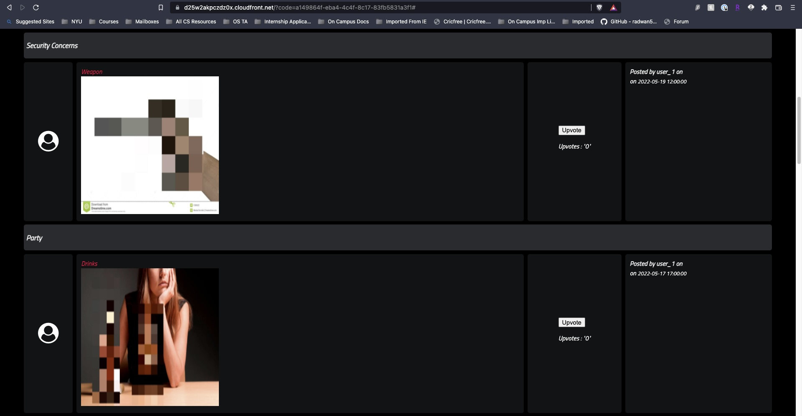
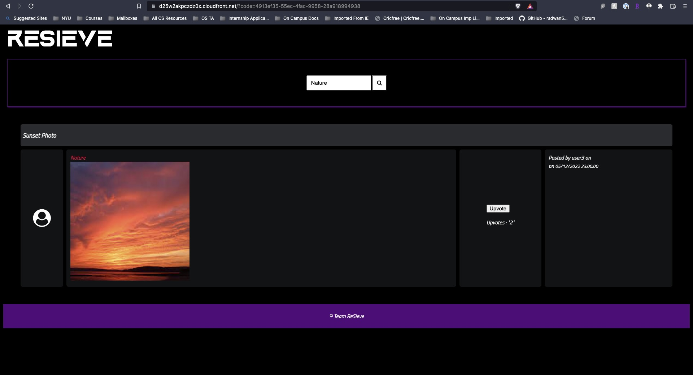

# ReSieve - A Safer Community Forum
### Filtering Content, Bettering Lives

Final Project, CS-GY 9223 Cloud Computing, Spring 2022 (Prof. Sambit Sahu)

## Motivation

We use Internet Forums and Social Media everyday. With its ever-increasing exposure to kids and young adults has made it disturbingly easy to be subjected to textual abuse through messaging platforms. We aim to develop a solution that acts as an effective filter for moderating toxic image and text posts. The project idea is to mimic some primitive features like post, search and upvote present on social media platforms by effectively using AWS components. Additionally, to develop a ML model for Filtering Offensive Text Posts.

## Team Members

    - Harsh Apte
    - Savani Gokhale
    - Somya Kapoor
    - Akshit Gandhi

## Features
    - Authentication
    - Filter out offensive messages
        - Don't allow user to post offensive text on the platform 
    - Filter out offensive images
        - Don't allow user to post inappropriate images
    - Report Negative Posts
        - Sentiment analysis
            - Inform admin if user post more than 3 negative comments
    - Search Posts
    - Upvote Posts

## System Architecture

## List of APIs

    - dataUpload/
    - textUpoad/
    - searchData/

## Demo Screenshots

    - Homepage 

    - Login Window

    - First Page

    - Image Warning

    - Text Warning

    - Image Moderation

    - Search Posts

